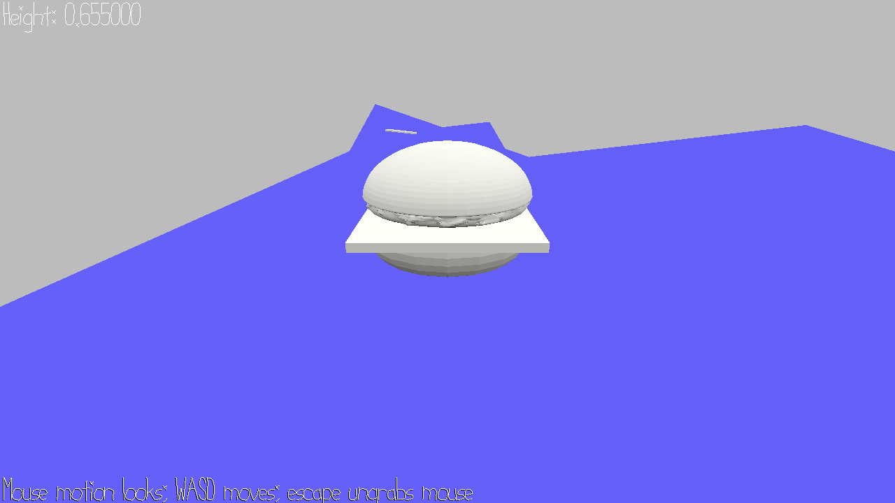

# Tower of Hamburg

Author: Shao-Ju Wang

Design: This game uses WalkMesh to walk on rough terrain. You need to find as much ingredient

Screen Shot:

How To Play:

WASD to control burger. Approach ingredient to collect them.

Sources: Source Code from Prof. Jim McCann

Bug: 1. After some add_ingredient, the position becomes higher (looks dettached from the WalkMesh)
	2. After some add_ingredient, the height of burger becomes outrageously tall

This game was built with [NEST](NEST.md).

